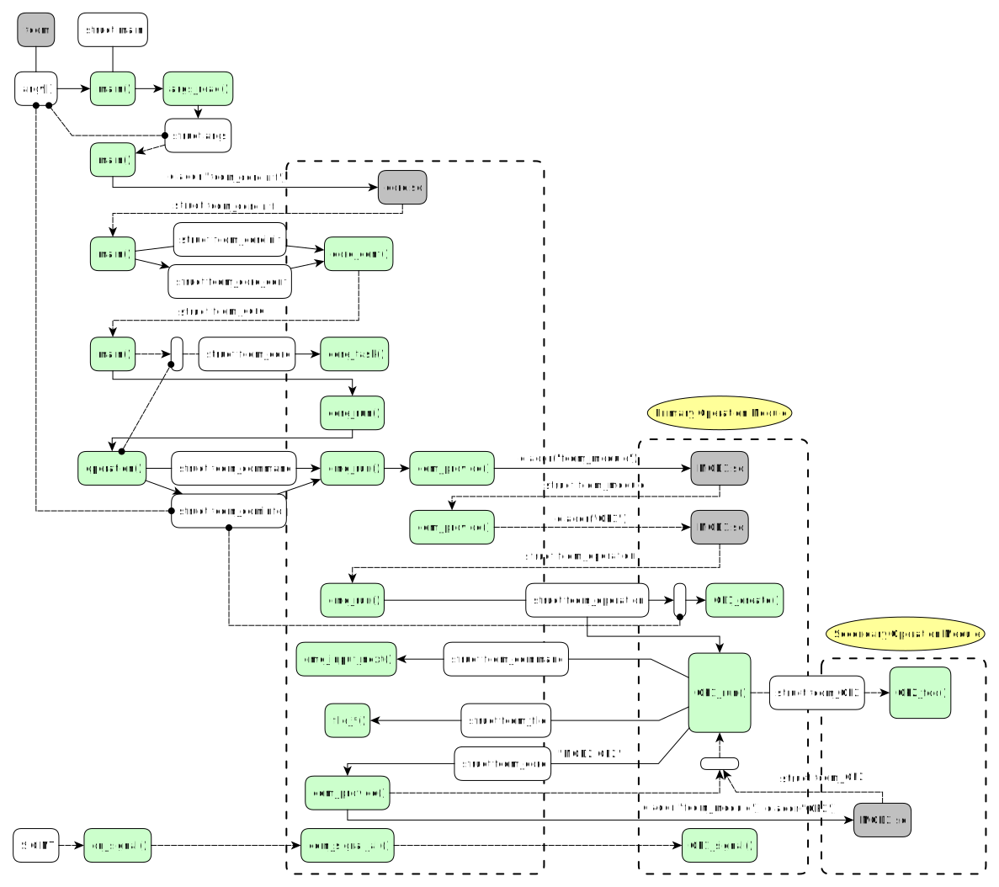

# fcom Architecture

fcom is just a bunch of different modules operating in a shared memory space.
Each module knows its own job and relies on other modules to perform their particular job.
Modules are linked to each other via Core.
The key idea here is to provide convenient interfaces for an operation module to do its job, such as asynchronous I/O events delivery (e.g. timers).
The Core interacts with each module and provides the standard way for each module to find each other, talk to each other and send/receive asynchronous events to each other.

Here's an example how fcom initializes its core resources, how Core finds an operation handling function, and finally, how this operation module finds a secondary operation interface from another module.

## Initialization

* When user executes fcom binary file, he passes some command-line arguments to it, which we see as `argv[]` array in our code.
* `main()` function creates its context object, then it parses the global CL arguments with `args_read()` into `args` object.  The arguments we parse here could be some logging settings or other very important global parameters.

> Note that at this point we can't parse *all* CL arguments, because we just don't know anything about them - only operation module itself can do this job.

## Core initialization

* Load `core.so` library and get the interface `fcom_coreinit` from it.
* Using this interface we pass to `fcom_coreinit::conf()` the initial configuration settings (`struct fcom_core_conf`) to Core and get the interface `fcom_core`.
* We call `fcom_core::task()` to add a new job for Core to execute from within.  We pass the pointer to our function `operation()` which, when called, will start the operation the user ordered us to perform.
* Call `fcom_coreinit::run()` which starts Core main loop.  This function blocks execution and will return only after `fcom_core::exit()` is called.

## Prepare for operation

* After a very short delay, our function `operation()` is called which now can actually start the operation using `fcom_command` interface via its `fcom_command::run()` function.  We pass `fcom_cominfo` object to it, which has been previously created by `fcom_command::create()`.  At this point we can manually set `fcom_cominfo` object fields or just link our `argv[]` to it so that Core can parse CL arguments itself.
* Inside `cmd_run()` function we parse more CL arguments from `argv[]` and now we see what operation user wants us to perform.
* Call `com_provide()` to get the primary operation interface.  It finds and loads the appropriate `.so` module and returns the interface we are looking for.
* We create the operation instance with `fcom_operation::create()` and now we're ready to execute it.

## Operation execution

* Call `fcom_operation::run()` which finally passes the control to the operation module.  The module now is free to do literally anything it wants.
* The first thing it probably wants is to parse the rest of CL arguments from `argv[]`.  It simply calls `fcom_command::args_parse()` which translates the text CL arguments into a C structure object.
* Then it probably wants to get the input files or directories specified by the user, which it does by calling `fcom_command::input_next()` function.  There are also several techniques to speed up the processing of input directories with `--recursive` switch that we can use here.
* The module can use `fcom_file` interface to work with files and `fcom_core` interface for asynchronous events and other stuff.
* But the most important thing is that the module can load another module and directly use the abilities this secondary module provides.  It uses `fcom_command::provide()` to get the needed interface and start calling its functions which secondary module will perform on our behalf.
* Any operation module, primary or secondary, can in turn start any other operation or load any other module to do the required work using the same `fcom_command::create()` and `fcom_command::run()` functions we've already discussed here.  All these operations will run in parallel with Core handling asynchronous events delivery to all of them.

## Shutdown and system process signal delivery

Of course it's not enough to just pass control to the target module without having a way for it to finish its work properly after the operation completes or is interrupted (by UNIX signal, for example).

* When the primary operation finishes, it just simply calls `fcom_core::exit()` with some return code, which eventually will be the fcom process's exit code.
* When the secondary operation finishes, it just signals to its caller or simply returns the control to it.
* When an interrupt signal (e.g. SIGINT) from user is received by the process, we pass it to `fcom_command::signal_all()` which walks through all registered operation instances and delivers the signal to them via `fcom_operation::signal()`.  At this point the primary operation either waits for its secondary operations to finish normally or immediately calls `fcom_core::exit()`.
* In any case after `fcom_core::exit()` is called, the main thread which was blocked by `fcom_coreinit::run()` is now unblocked, and the `main()` function can exit.
